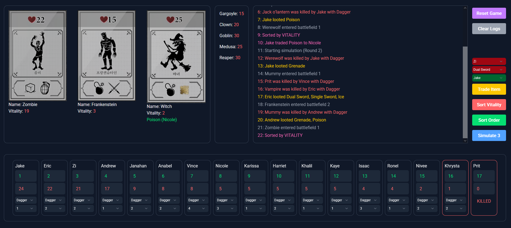

# halloween-monster

Simulate turns in the game halloween monster



## Dev

Install dependencies with `npm install`

```bash
npm run dev
```

## Game Rules

- All players receive 5 vitality and the basic weapon card Dagger
- The attack power of the weapon will be used to reduce the vitality of the target within the declared battlefield, resulting in death of the target when the vitality reaches zero
- When players finish selecting battlefields and weapons, the attacks are automatically applied based on the order of attack
- When a monster dies, the player who reduced the monster’s vitality to zero will be revealed and the player acquires the target’s vitality and loot
- When a monster dies, the monster is immediately removed from the battlefield and the monster in the leftmost spot in the queue fills the vacancy
    - Attacks earlier declared by players against this battlefield will be carried out against the monster that filled the vacancy
    - If a player’s attack value is greater than the remaining vitality of the battlefield target, no damage is carried over to the next target to enter the battlefield
- When all player’s attacks have been carried out, the round ends

### Weapons
- Dagger: Basic weapon, 3 Damage
- Poison: Special weapon, 1 Damage at the end of each player’s attack
- Ice: Special weapon, 3 Damage. Until the next attack of the player who used this weapon, the monster does not take damage
- Double Sword: Special weapon, 4 Damage. You can attack up to two monsters at a time, the damage is reduced to 2 when attacking two monsters
- Grenade: Special weapon, 6 Damage
- Time Bomb: Special weapon, 10 Damage. Damage the battlefield in the next attack of the player who used this weapon

The order of weapon damage and effect application is Ice Release > Weapon Damage (Dagger/Double Sword/Grenade/Ice) > Time Bomb > Poison